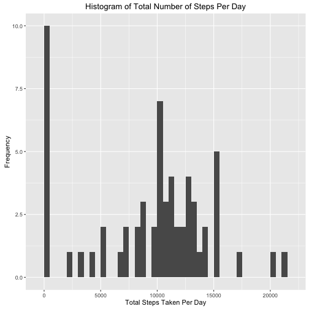
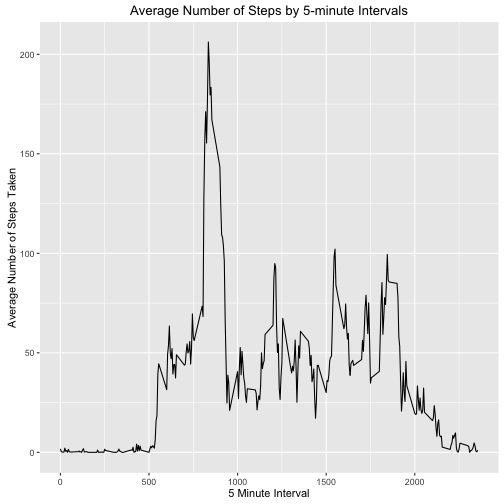
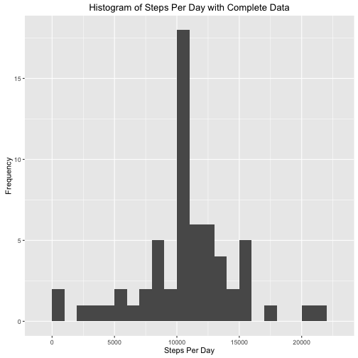
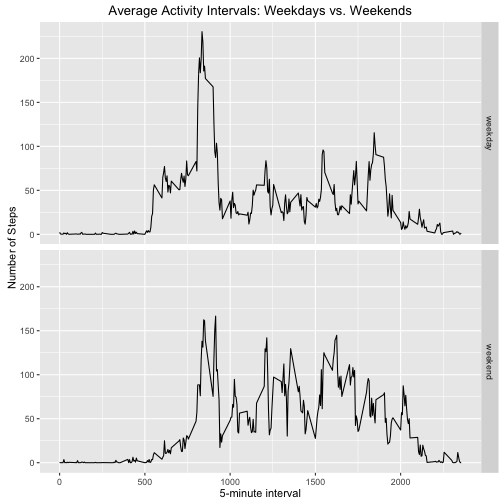

#Reproducible Research: Peer Assessment 1

## Library Installation and Prep
*Load knitr package to to process the doucment and the ggplot2 for plotting. 

```r
library(knitr)
library(ggplot2)
```
*Set echo=TRUE as the default to allow others to read the code.

```r
opts_chunk$set(echo = TRUE)
```

## Loading and preprocessing the data
1. Load the acitivity.csv data

```r
if(!file.exists('activity.csv')){
    unzip('activity.zip')
}
activity <- read.csv('activity.csv')
```

*Check the data strucutre

```r
str(activity)
```

```
## 'data.frame':	17568 obs. of  3 variables:
##  $ steps   : int  NA NA NA NA NA NA NA NA NA NA ...
##  $ date    : Factor w/ 61 levels "2012-10-01","2012-10-02",..: 1 1 1 1 1 1 1 1 1 1 ...
##  $ interval: int  0 5 10 15 20 25 30 35 40 45 ...
```

The dataset includes the following variable:
*steps: Number of steps taking in a 5-minute interval (missing values are coded as 𝙽𝙰)
*date: The date on which the measurement was taken in YYYY-MM-DD format.
*interval: Identifier for the 5-minute interval in which measurement was taken.

2. Process/transform the data into a format suitable for your analysis.
* Convert character strings to dates.


```r
activity$date <- as.Date(activity$date)
```

## What is mean total number of steps taken per day?
1. Calculate the total number of steps taken per day


```r
StepsPerDay <- tapply(activity$steps, activity$date, FUN=sum, na.rm=TRUE)
```


```r
StepsPerDay
```

```
## 2012-10-01 2012-10-02 2012-10-03 2012-10-04 2012-10-05 2012-10-06 
##          0        126      11352      12116      13294      15420 
## 2012-10-07 2012-10-08 2012-10-09 2012-10-10 2012-10-11 2012-10-12 
##      11015          0      12811       9900      10304      17382 
## 2012-10-13 2012-10-14 2012-10-15 2012-10-16 2012-10-17 2012-10-18 
##      12426      15098      10139      15084      13452      10056 
## 2012-10-19 2012-10-20 2012-10-21 2012-10-22 2012-10-23 2012-10-24 
##      11829      10395       8821      13460       8918       8355 
## 2012-10-25 2012-10-26 2012-10-27 2012-10-28 2012-10-29 2012-10-30 
##       2492       6778      10119      11458       5018       9819 
## 2012-10-31 2012-11-01 2012-11-02 2012-11-03 2012-11-04 2012-11-05 
##      15414          0      10600      10571          0      10439 
## 2012-11-06 2012-11-07 2012-11-08 2012-11-09 2012-11-10 2012-11-11 
##       8334      12883       3219          0          0      12608 
## 2012-11-12 2012-11-13 2012-11-14 2012-11-15 2012-11-16 2012-11-17 
##      10765       7336          0         41       5441      14339 
## 2012-11-18 2012-11-19 2012-11-20 2012-11-21 2012-11-22 2012-11-23 
##      15110       8841       4472      12787      20427      21194 
## 2012-11-24 2012-11-25 2012-11-26 2012-11-27 2012-11-28 2012-11-29 
##      14478      11834      11162      13646      10183       7047 
## 2012-11-30 
##          0
```

2. Make a histogram of the total number of steps taken each day using the qplot function.


```r
qplot(StepsPerDay, binwidth=500, xlab="Total Steps Taken Per Day", ylab = "Frequency", main = "Histogram of Total Number of Steps Per Day")
```



3. Calculate and report the mean and median of the total number of steps taken per day.


```r
meanSteps <- mean(StepsPerDay, na.rm=TRUE)
medianSteps <- median(StepsPerDay, na.rm=TRUE)
```

## What is the average daily activity pattern?
1. Make a time series plot (i.e. 𝚝𝚢𝚙𝚎 = "𝚕") of the 5-minute interval (x-axis) and the average number of steps taken, averaged across all days (y-axis)

* Calculte the average number of steps taken per day, measured at each 5-minute interval.


```r
stepsbyInterval <- aggregate(steps ~ interval, data = activity, FUN=mean, na.rm=TRUE)
```

*Verify the data by looking at the first few rows

```r
head(stepsbyInterval)
```

```
##   interval     steps
## 1        0 1.7169811
## 2        5 0.3396226
## 3       10 0.1320755
## 4       15 0.1509434
## 5       20 0.0754717
## 6       25 2.0943396
```

* Make a time series plot of data grouped by intervals of 5 minutes.


```r
ggplot(data = stepsbyInterval, aes(x=interval, y=steps)) + geom_line() + xlab("5 Minute Interval") + ylab("Average Number of Steps Taken") + ggtitle("Average Number of Steps by 5-minute Intervals")
```




2. Which 5-minute interval, on average across all the days in the dataset, contains the maximum number of steps?


```r
mostSteps <- stepsbyInterval[which.max(stepsbyInterval$steps),]
```


## Imputing missing values
1. Calculate and report the total number of missing values in the dataset (i.e. the total number of rows with 𝙽𝙰s)


```r
MissingValues <- subset(activity, is.na(steps))
summary(MissingValues)
```

```
##      steps           date               interval     
##  Min.   : NA    Min.   :2012-10-01   Min.   :   0.0  
##  1st Qu.: NA    1st Qu.:2012-10-26   1st Qu.: 588.8  
##  Median : NA    Median :2012-11-06   Median :1177.5  
##  Mean   :NaN    Mean   :2012-11-01   Mean   :1177.5  
##  3rd Qu.: NA    3rd Qu.:2012-11-11   3rd Qu.:1766.2  
##  Max.   : NA    Max.   :2012-11-30   Max.   :2355.0  
##  NA's   :2304
```

2. Fill in all of the missing values in the dataset using the mean for that 5-minute interval.


```r
ValuetoFill <- function (steps, interval) {
        filled <- NA
        if(!is.na(steps))
                filled <- c(steps)
        else
                filled <- (stepsbyInterval[stepsbyInterval$interval ==interval, "steps"])
        return (filled)
}
```

3. Create a new dataset that is equal to the original dataset but with the missing data filled in.

```r
FilledData <-activity
FilledData$steps <- mapply(ValuetoFill, FilledData$steps, FilledData$interval)
```

4. Make a histogram of the total number of steps taken each day and Calculate and report the mean and median total number of steps taken per day. 

* Determine the total number of steps taken each day, mean, and median for the Filled Data.


```r
totalSteps <- tapply(FilledData$steps, FilledData$date, FUN = sum)
```

* Make a histogram of the total number of steps taken each day using the qplot function.


```r
qplot(totalSteps, binwidth = 1000, xlab="Steps Per Day", ylab = "Frequency", main = "Histogram of Steps Per Day with Complete Data" )
```



*Calculate and report the mean and median total number of steps taken per day. 


```r
meanSteps <- mean(totalSteps, na.rm=TRUE)
medianSteps <- median(totalSteps, na.rm=TRUE)
```

* Do these values differ from the estimates from the first part of the assignment? 

Yes, the mean and median values both increased slightly from the first part of the assignment.

* What is the impact of imputing missing data on the estimates of the total daily number of steps?

The estimates of the total daily number of steps increased with the added values.

## Are there differences in activity patterns between weekdays and weekends?
1. Create a new factor variable in the dataset with two levels – “weekday” and “weekend” indicating whether a given date is a weekday or weekend day.

```r
WeekdayorWeekend <- function(date) {
        day <- weekdays(date)
         if (day %in% c("Monday", "Tuesday", "Wednesday", "Thursday", "Friday"))
        return("weekday")
    else if (day %in% c("Saturday", "Sunday"))
        return("weekend")
    else
        stop("invalid date")
}
FilledData$date <- as.Date(FilledData$date)
FilledData$day <- sapply(FilledData$date, FUN = WeekdayorWeekend)
```

2. Make a panel plot using ggplot containing a time series plot (i.e. 𝚝𝚢𝚙𝚎 = "𝚕") of the 5-minute interval (x-axis) and the average number of steps taken, averaged across all weekday days or weekend days (y-axis). 

```r
meanStepsNoNas <- aggregate(steps ~ interval + day, data=FilledData, FUN=mean)
```

```r
ggplot(meanStepsNoNas, aes(interval, steps)) + geom_line() + facet_grid(day ~ .) + xlab("5-minute interval") + ylab("Number of Steps") + ggtitle("Average Activity Intervals: Weekdays vs. Weekends")
```


The number of steps for all weekend intervals are high, whereas they appear concentrated in the morning hours for weekdays.


